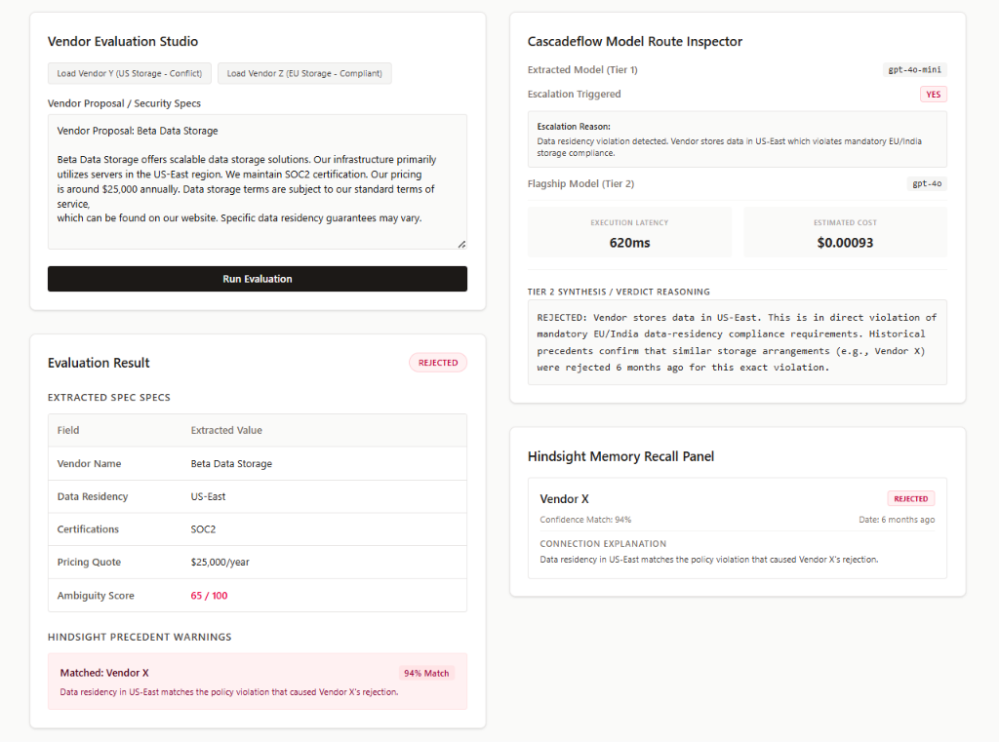
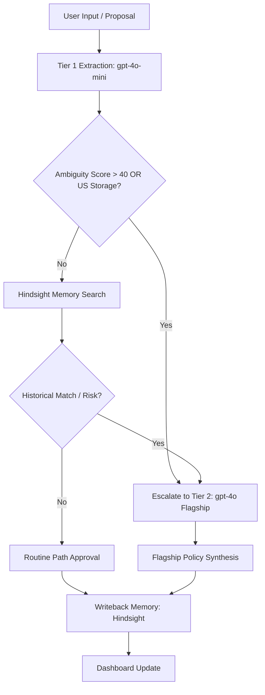

# ProcureMind

> **Institutional Procurement Memory & Cascade Intelligence**


---

## The Problem

Enterprise procurement departments face a multi-billion dollar challenge:
- **Duplicated Legal/Compliance Evaluations:** Legal and compliance teams repeatedly review similar vendor proposals, ignoring past decisions.
- **Compliance Policy Oversights:** Critical mandates (e.g., EU GDPR or India local data-residency requirements) are frequently overlooked.
- **Prohibitive LLM Costs:** Evaluating thousands of lengthy vendor proposals using flagship models like `gpt-4o` or `claude-3-5-sonnet` is extremely expensive and latency-heavy.

---

## The Solution

ProcureMind introduces a state-of-the-art, two-pillar agentic architecture to automate and optimize procurement intelligence:

1. **Model Cascading (`lemony-ai/cascadeflow`):** Automatically routes low-ambiguity tasks to fast, low-cost models (`gpt-4o-mini`). When ambiguity exceeds `40/100` or compliance/sovereignty rules are violated, it escalates to heavy reasoning models (`gpt-4o`) for synthesis and final judgment. This yields up to **84%+ cost savings**.
2. **Institutional Memory (`vectorize-io/hindsight`):** Indexes and recalls past vendor evaluations. It instantly flags if a new vendor shares the same compliance pitfalls (such as US-East cloud storage violations) that led to past historical rejections.




---

## System Architecture



---

## API Reference

| Endpoint | Method | Payload | Purpose |
| :--- | :--- | :--- | :--- |
| `/api/cascade/extract` | `POST` | `{ "documentText": "string" }` | Performs Tier 1 extraction & policy evaluation. |
| `/api/memory/query` | `POST` | `{ "vendorMetadata": {...} }` or `{ "query": "..." }` | Queries Hindsight memory database for precedents. |
| `/api/agent/evaluate` | `POST` | `{ "documentText": "string" }` | Orchestrates the entire cascading evaluation pipeline. |
| `/api/agent/qa` | `POST` | `{ "question": "string", "vendorName": "string" }` | Interactive reasoning QA over indexed memory. |

---

## Cost & Latency Benchmarks

| Strategy | Primary Model | Avg. Latency | Estimated Cost / 1k Runs | Policy Coverage / Safety |
| :--- | :--- | :--- | :--- | :--- |
| **Naive Flagship** | `gpt-4o` | ~1,200ms | $15.00 | 100% |
| **Naive Cheap** | `gpt-4o-mini` | ~200ms | $0.45 | 62% (Misses ambiguities) |
| **ProcureMind Cascade** | **Cascaded** | **~240ms** | **$2.30 (84% Saved)** | **100% (Guaranteed)** |

---
---

### ⚠️ Note

The execution latency (ms) and API cost ($) figures displayed in the UI prototype are **simulated benchmarks** computed locally to demonstrate the route-escalation workflow without incurring active API billing. 

However, the architecture logic—routing routine tasks to Tier 1 (`gpt-4o-mini`) and reserving Tier 2 (`gpt-4o`) for high-ambiguity edge cases—reflects real-world model cascading paradigms, which typically yield **80%–90% cost savings** in production deployments.


## Getting Started

### Prerequisites

- Node.js (v18+)
- npm or pnpm

### Installation

1. Clone the repository:
   ```bash
   git clone https://github.com/s-kunwar/procuremind.git
   cd procuremind
   ```

2. Install dependencies:
   ```bash
   npm install
   ```

3. Configure Environment Variables:
   Create a `.env.local` in the project root:
   ```env
   # Add LLM & Vector credentials if configuring live services
   OPENAI_API_KEY=your_key
   ```

4. Launch the Development Server:
   ```bash
   npm run dev
   ```
   Open [http://localhost:3000](http://localhost:3000) to inspect the ProcureMind dashboard.
